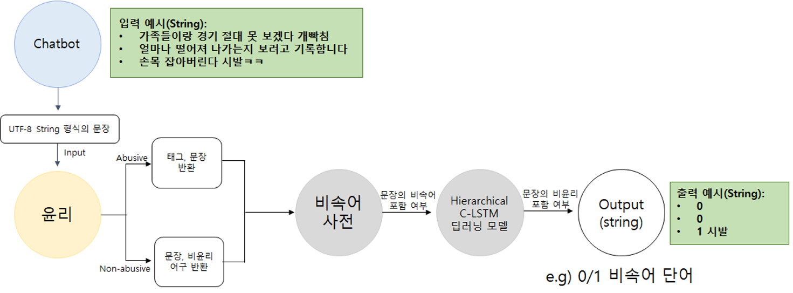

<<<<<<< HEAD
# Flagship 5차년도 비윤리모듈

버전: 2.0
작성자: 이주형
히스토리: 2020/12/31

***

## 1. 개발환경

#### 서버환경
* OS: Ubuntu 18.04 or 16.04
* GPU driver : Nvidia CUDA 10.1 or 10.2

#### 권장사항
* 파이썬 : Python3.5 이상
* 프레임워크: Pytorch 0.3.0 이상

***

## 2. README.md

***

#### Note

* 2020/12/31 12월 마스터 버전이 업데이트 되었습니다.

***

#### System/SW Overview

* 개발목표: 딥러닝 모델과 사전을 사용하여 User의 대화 내용에 대한 윤리/비윤리성을 판단하고, 비윤리성에 비속어가 포함된 경우 이를 User에게 출력한다.

* 동작: ChatBot 모듈로부터 User와 대화하고 대응할 수 있는 문장을 Input data로 수신하고, 수신받은 문장을 비속어 사전과 딥러닝 모델을 통해 검토 후 얻은 판단 결과를 Output data로 송신 와 최종 결과물의 동작을 설명하고, 시스템/SW 대표 그림을 첨부한다. 

  

***

#### How to Install

```(bash)
pip install -r requirements.txt
```

***

#### Main requirement

* python 3.6.2
* pytorch 1.0.0
* six
* hgtk
* flask

***

#### Network Architecture and features

* **Model**: Hierarchical Network based on C-LSTM 

  

  

* **Architecture**: The C-LSTM that combines CNN and LSTM for text classification, and has advantage of both architecture. The CNN exracts a sequence of local information of sentences and LSTM obtains the representation of a sentence. We use 100 filters in the hidden state, followed by a dropout layer with a rate of 0.5. Afterward, we apply the 1D max-pooling operation to reduce the dimensionality of the LSTM output features. Finally, a linear layer with the sigmoid function predicts the binary label classification.

* **Word embedding layer**: We initialized using word2vec model trained on our corpus. Embedding layer may be either fixed or fine-tuned along with other weigths of the network

* **Metrics**: F1-score

***

#### Model Training

* python train.py (모델 훈련)

* 훈련된 모델은 "./data/abusive_detection_new.pt"로 저장됨


***

#### Quick Start

* flask, hgtk, six 파이썬 패키지 추가 

  ```markdown
  pip install flask
  pip install hgtk
  pip install six
  pip install torch==1.0.0
  ```

  * save_file  (abusive_detection.pt, embed_lookup.pt, weights.pt 는 아래 구글드라이브에서 다운)
  * https://drive.google.com/drive/folders/1CNtJ8AUVEgMoGWcuZ4u__e_LlKs3YARh

* python run.py (비윤리 탐지 모델 실행)

* 로컬 접속

  ```markdown
  로컬ip:5000/index
  ```

***

#### HTTP-server API description

* **path, parameter, response를 명시한다.**

> * JSON parameters are:

> |Parameter|Type|Description|
> |---|---|---|
> |context|strings|input messages from the dialogue|
> |context|strings|One of {'abusive', 'not abusive'}.|

> * Request
> ```
> Input
> {
>     "text" : "[사용자 입력]"
> }
> 
> Output
> {
>     "dev_code" : "1",
>     "dev_msg" : "success",
>     "return_object" : "[모델 출력]" (abusive or non-abusive)
> }
> ```

***

#### Repository overview

* `absive_detection`- algorithms for abusiveness detection
* `data` - contains train/test dataset
